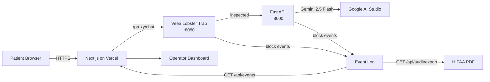

# Mindoor — HIPAA-Grade AI Front Desk

> **The AI receptionist a HIPAA compliance officer will actually sign off on.**  
> Veea-governed · Gemini 2.5 Flash · Regulator-auditable · One-click HIPAA PDF export

[](#)
[](https://github.com/veeainc/lobstertrap)
[](https://ai.google.dev)
[](LICENSE)

---

## The Problem

Healthcare and wellness clinics are rushing to adopt AI front-desk agents to reduce burnout and cut costs. But the moment an AI handles a patient conversation, it inherits **HIPAA**. One successfully injected prompt, one PHI exfiltration, one role-escalation attack — and the clinic has a reportable breach, a $10M average liability, and a CMS audit.

Current AI receptionists ship with no policy enforcement, no conversation-layer security, and nothing a compliance officer can sign off on.

## The Solution

**Mindoor** puts **Veea's Lobster Trap** in front of every patient conversation as the trust layer. Every message is deep-inspected before it reaches Gemini. Every interaction is logged. Every security incident is exportable as a regulator-readable PDF mapped to HIPAA §164.312 Technical Safeguards.

```
Patient → Next.js UI → Veea Lobster Trap (policy enforce) → FastAPI + Gemini 2.5 Flash
                                  ↓
                           Audit Event Log ──→ HIPAA PDF Export (one click)
```

## Architecture



**Three security layers:**
1. **Veea Lobster Trap** — network-layer deep prompt inspection, policy enforcement
2. **FastAPI regex** — 22 healthcare-specific application-layer attack patterns
3. **Gemini system prompt** — HIPAA-aware refusal protocol at the model layer

## Live Metrics

| Metric | Value |
|--------|-------|
| Attack block rate | **[BLOCK_RATE_%]** (10-prompt healthcare red-team battery) |
| False positive rate | **[FPR_%]** (legitimate appointment requests) |
| Median added latency | **[LATENCY_MS] ms** |
| Attack categories defended | **10** (PHI exfil, billing fraud, role escalation, jailbreak, injection, …) |

## Features

- **Patient chat interface** — HIPAA-aware AI receptionist with real-time appointment booking
- **Operator security dashboard** — split-screen: patient chat (left) + live security event feed (right)
- **HIPAA Audit Report PDF** — one-click export: incident log, §164.312 mapping, signature block
- **Red-team validated** — 10 healthcare-specific attack categories tested
- **Dual-track submission** — Veea Lobster Trap (Track 1) + Google Gemini (Track 2)

## Tech Stack

| Layer | Technology |
|-------|-----------|
| Frontend | Next.js 16, React 19, Tailwind v4, GSAP |
| Security proxy | Veea Lobster Trap (MIT) |
| Backend | FastAPI, Python 3.11 |
| LLM | Google Gemini 2.5 Flash |
| PDF generation | ReportLab |
| Frontend hosting | Vercel |
| Backend hosting | Fly.io / Railway |

## Quickstart (Docker)

```bash
git clone https://github.com/YOUR_ORG/mindoor && cd mindoor
cp secure-ai-receptionist/.env.example secure-ai-receptionist/.env
# Add GEMINI_API_KEY to .env
docker compose up
```

- `http://localhost:3000` — Patient chat
- `http://localhost:3000/operator` — Security operator dashboard  
- `http://localhost:8080/_lobstertrap/` — Lobster Trap native dashboard

## Manual Setup

### Backend
```bash
cd secure-ai-receptionist
python -m venv venv && source venv/bin/activate
pip install -r requirements.txt
uvicorn main:app --host 0.0.0.0 --port 8000
```

### Lobster Trap Proxy
```bash
cd secure-ai-receptionist/veea-security
./lobstertrap serve --config policy.yaml --target http://localhost:8000 --port 8080
```

### Frontend
```bash
cd receptionist-ui
cp .env.example .env.local   # add BACKEND_URL + LOBSTER_TRAP_URL if needed
npm install && npm run dev
```

## Environment Variables

### Frontend (`receptionist-ui/.env.local` or Vercel dashboard)
| Variable | Default | Description |
|----------|---------|-------------|
| `BACKEND_URL` | `http://localhost:8000` | FastAPI URL (server-side rewrite) |
| `LOBSTER_TRAP_URL` | `http://localhost:8080` | Lobster Trap URL (server-side rewrite) |

### Backend (`secure-ai-receptionist/.env`)
| Variable | Description |
|----------|-------------|
| `GEMINI_API_KEY` | Google AI Studio API key |

## Track Alignment

### Track 1 — Agent Security & AI Governance (Veea)
- Guardrails and safety layers for agentic workflows
- Monitoring and observability (real-time operator dashboard)
- Audit trails for regulated industries (HIPAA PDF, §164.312 mapping)
- Access control and permission frameworks (multi-layer enforcement)
- Red-teaming validated (healthcare adversarial battery)

### Track 2 — AI Agents with Google AI Studio
- Gemini 2.5 Flash as the reasoning engine
- Tool use (`check_availability` — practice management integration)
- Long-context healthcare conversation handling
- Production-ready enterprise agent workflow

## Repository Structure

```
mindoor/
├── secure-ai-receptionist/   # FastAPI backend + Veea security
│   ├── main.py               # Core orchestrator, event log, PDF export
│   ├── requirements.txt
│   ├── Dockerfile
│   ├── veea-security/
│   │   ├── lobstertrap       # Lobster Trap binary
│   │   └── policy.yaml       # HIPAA-tuned security policy
│   └── red_team/             # Adversarial test battery
│       ├── attacks.jsonl
│       ├── benign.jsonl
│       └── run_battery.py
└── receptionist-ui/          # Next.js frontend
    ├── src/app/
    │   ├── page.tsx           # Patient chat
    │   └── operator/page.tsx  # Security operator dashboard
    ├── src/components/
    │   ├── ChatInterface.tsx
    │   ├── SecurityFeed.tsx
    │   ├── EventCard.tsx
    │   └── StatStrip.tsx
    └── next.config.ts         # API rewrites for Vercel
```

## License

MIT

---

*Built for the TechEx Intelligent Enterprise Solutions Hackathon — May 2026*  
*Veea Lobster Trap: [github.com/veeainc/lobstertrap](https://github.com/veeainc/lobstertrap) (MIT)*
